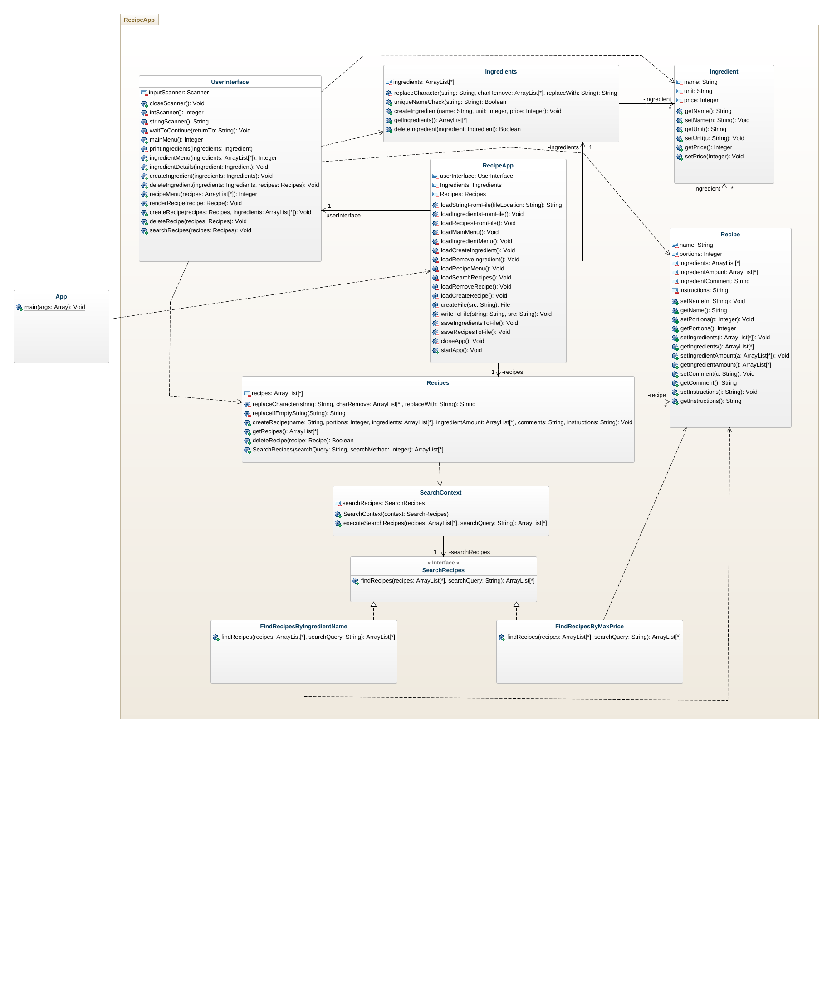

# Klassdiagram efter implementation

## Beskrivning

### App
App är den klass som applikationen startas ifrån.

### RecipeApp 
RecipeApp lagrar Ingredients, Recipes och userInterface objekten. Ingredients och Recipes objekten skickas till olika metoder i UserInterface för att kunna visa ingredienser i terminalen. Klassen används även för att spara och ladda ingredienser och recept.

### Ingredients
Ingredients används för att lagra ingrediens objeken i ett attribut (array list) och för att hämta, ta bort och skapa ingredienser.

### Ingredient
Ingredient representerar en ingrediens. I objektet lagras namn, enhet och pris.

### Recipes
Recipes hanterar recept objekten. Klassen lagrar Recipe objekten i ett attribut. Dessa kan hämtas, skapas, tas bort och sökas efter.

### SearchContext, SearchRecipes, FindRecipesByIngredientName, FindRecipesByMaxPrice
Dessa klasser representerar designmönstret strategy pattern. Designmönstret används för att söka efter recept utifrån ingrediens namn och högsta pris.