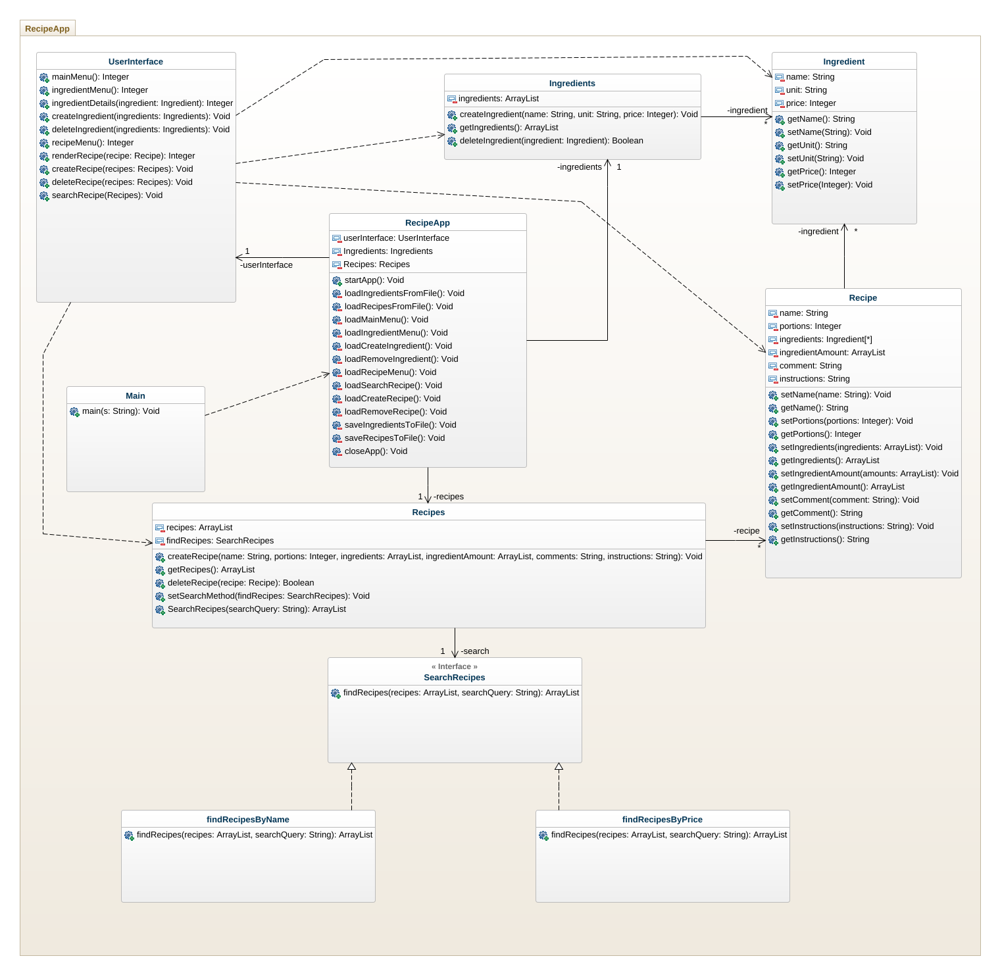

# Klassdiagram före implementation

## Beskrivning

### RecipeApp
RecipeApp är en klass som lagrar objekten som hanterar ingredienser och klasser, samt användargränssnittet. Klassens uppgift är att hjälpa UserInterface med att skicka objekten som hanterar ingredienser och recept vid behov.

### UserInterface
Klassen hanterar metoderna som renderar de olika sidorna i konsollfönstret, samt användarens inmatning.

### Ingredients
Ingredients är en klass som hanterar Ingredient objekten. Varje ingrediensobjekt lagras i en ArrayList. Metoderna i klassen kan returnera ingredienserna i en ArrayList, skapa en ny eller ta bort en ingrediens.

### Ingredient
Ingredient är en klass som representerar en ingrediens. Den lagrar sitt namn, mått och pris. Dessa kan hämtas med get/set metoder.

### Recipes
Recipes är en klass som hanterar recepten. Dessa lagras i en ArrayList (med Recipe objekt). Klassen har även metoder för att skapa recept, hämta alla recept, ta bort recept och för att söka efter recept med hjälp av namn eller pris.

### SearchRecipes, findRecipesByName, findRecipesByPrice
Dessa tre klasser används för att söka efter recept med hjälp av namn eller pris. Dessa tre klasser följer designmönstret strategy pattern.

### Recipe
Recipe är en klass som representerar ett recept. I klassen lagras namn, portioner, ingredienser, ingrediensernas mängd, kommentarer och instruktioner. Dessa kan ändras och hämtas med get/set metoderna.